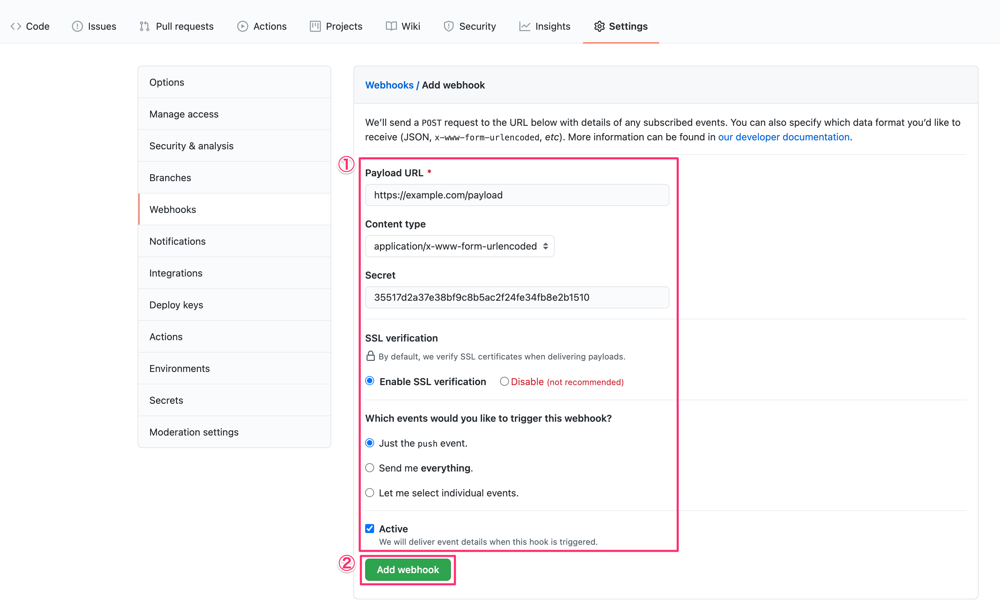
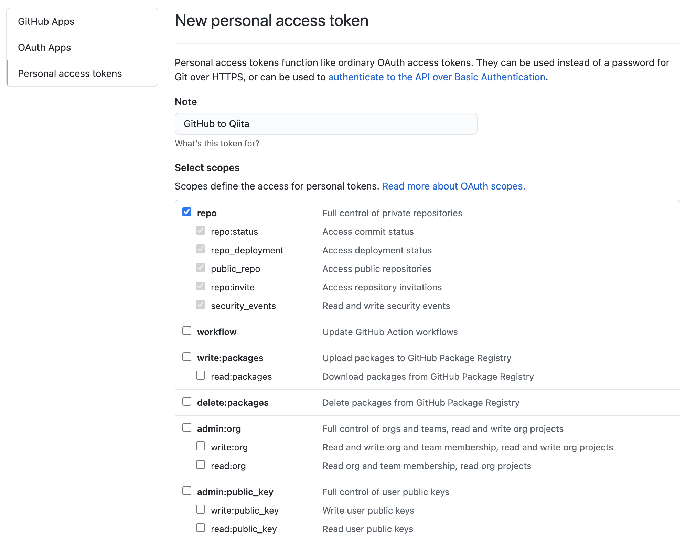
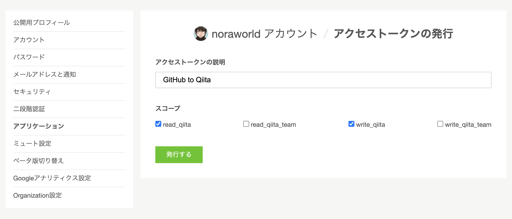

# IMPORTANT NOTES
The new implementation is available at [noraworld/github-to-qiita](https://github.com/noraworld/github-to-qiita). It is easy to use because it uses GitHub Actions, which means you do not have to prepare your own server. Happy publishing!

This repository is no longer maintained.

# GitHub-to-Qiita (OLD)
Pushing development articles into the specific repository, they will be published to [Qiita](https://qiita.com) via [Qiita API v2](https://qiita.com/api/v2/docs).

## Features
* When new file is added to GitHub repository, it will be published to Qiita as a new item
* When the existing file is modified on GitHub repository, the corresponding Qiita item will be modified

The multiple files of addition and modification are supported. When the multiple files are added and modified by one pushing, all of them will be published and modified at one time.

## Setup
### Add GitHub Webhooks
1. Visit `https://github.com/<GITHUB_USERNAME>/<GITHUB_REPOSITORY>/settings/hooks/new`
2. Fill in the mandatory information
3. Click `Add webhook` button


| Item | Description | Example | Note |
|---|---|---|---|
| Payload URL | Your URL that can receive GitHub Webhooks | `https://example.com/payload` | The path must be `/payload` |
| Content type | Select `application/x-www-form-urlencoded` | | |
| Secret | The random string | `35517d2a37e38bf9c8b5ac2f24fe34fb8e2b1510` | This token must not be known by other people |
| SSL verification | Select `Enable SSL verification` | | |
| Which events would you like to trigger this webhook? | Select `Just the push event.` | | |
| Active | Check | | |

**TIPS**: You can generate the random string for `Secret` by `ruby -rsecurerandom -e 'puts SecureRandom.hex(20)'` easily.

### Generate GitHub personal access token
1. Visit https://github.com/settings/tokens/new
2. Fill in the mandatory information
3. Click `Generate token` button
4. Copy generated token and save it to other place temporarily


| Item | Description | Example | Note |
|---|---|---|---|
| Note | Your access token’s name | `GitHub to Qiita` | |
| Select scopes | Check `repo` | | |

### Generate Qiita personal access token
1. Visit https://qiita.com/settings/tokens/new
2. Fill in the mandatory information
3. Click generate button
4. Copy generated token and save it to other place temporarily


| Item | Description | Example | Note |
|---|---|---|---|
| Description | Your access token’s name | `GitHub to Qiita` | |
| Scopes | Check `read_qiita` and `write_qiita` | | |

### Complete `.env`
1. Copy `.env.sample` to `.env` (Execute `cp .env.sample .env`)
2. Fill in the mandatory information
3. Save file `.env`

| Variable | Description | Example | Note |
|---|---|---|---|
| GITHUB_REPOS | Your developers blog repository name with username on GitHub | `noraworld/developers-blog-content` | |
| INCLUDED_DIR | Only the contents in the directory specified by this env will be tracked | `articles` | The trailing slash is unnecessary |
| QIITA_ACCESS_TOKEN | Your personal Qiita access token generated a moment ago | `777fb820e25847dd659266a66dcdd99580b4b85f` | This token must not be known by other people |
| GITHUB_WEBHOOK_SECRET_TOKEN | Your GitHub webhook secret token filled in on GitHub Webhooks settings page a moment ago | `35517d2a37e38bf9c8b5ac2f24fe34fb8e2b1510` | This token must not be known by other people |
| GITHUB_PERSONAL_ACCESS_TOKEN | Your GitHub personal access token generated a moment ago | `d77af6cff2dd13f58886f6eff890eea93e53bdc9` | This token must not be known by other people |

### Run the script
Run `main.rb` at the domain specified at `Payload URL` on GitHub Webhooks settings.

```shell
$ ruby main.rb
```

Daemonize this script if needed.
